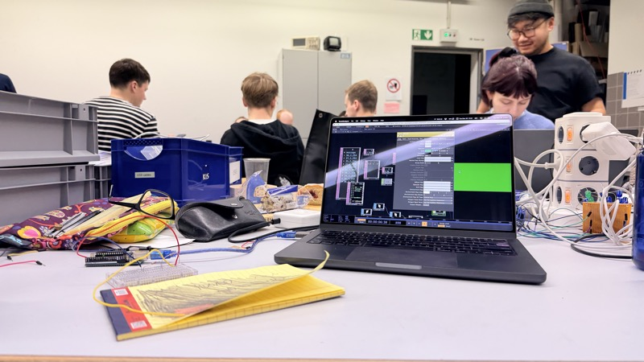
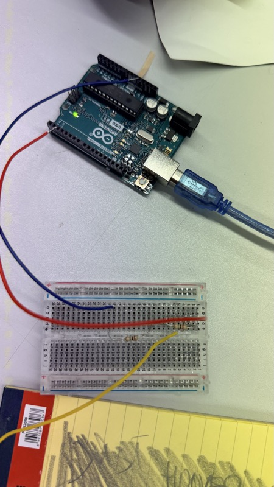
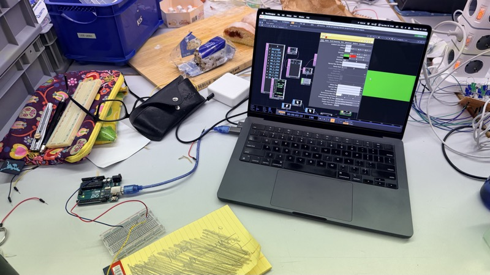
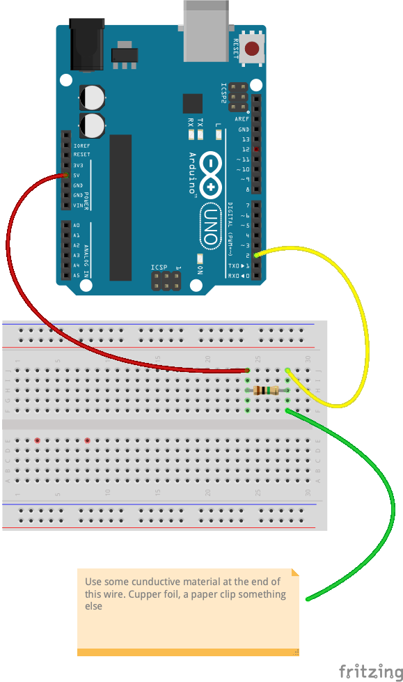

# Poor Humans Capacitive Touch Sensor

This is a low-tech version of a capacitive touch sensor. I found this [sketch on Instructables](https://www.instructables.com/Turn-a-pencil-drawing-into-a-capacitive-sensor-for/) by [alan.chatham](https://www.instructables.com/member/alan.chatham/)  years ago and always was intrigued by the simplicity of creating a touch sensor. Building your own high-low tech[^1] sensors gives you an idea how other high tech might work.

> [!WARNING]  
> This sketch only works on an Arduino R3 or similar Atmega boards. 

This sketch is also part of my workshops on Physical Computing. Any generic development will take place on [github.com/physical-computing/digitalio - capacitive_touch_paperclip](https://github.com/physical-computing/digitalio/tree/main/capacitive_touch_paperclip). Project specific documentation will be done here.

[^1]: Not my idea. See [http://highlowtech.org/](http://highlowtech.org/). Yes it is http.

## License

© 2025 Fabian Morón Zirfas. Licensed under CC-BY-4.0.
